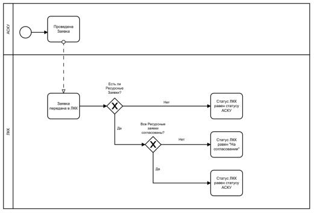

# Заявка	
																	
С точки зрения бизнес-процесса за рамками системы ЛКК, Заявка является прогнозом на ближайший месяц со стороны контрагента и основой для планирования производства и продаж.

Функциональность Заявок дает возможность пользователю системы (Контрагенту) формировать прогноз потребности в продукции на определенный период и получать информацию от менеджера АСКУ о содержимом заявки через использование функции комментирования заявки/

Заявки всегда формируются на основании Договора, одна заявка может быть сформирована на основании только одного договора. 

Заявки бывают двух типов:

1. Заявка типа **«Основная»** – формируется в качестве прогноза потребности на ближайший месяц.  
   Правила формирования Заявок:
   - По одному договору в одном открытом периоде может быть создана только одна Основная Заявка. Принадлежность Заявки к периоду определяется в АСКУ.
   - В случае, если по Договору не было создано основной заявки и период был закрыт, но период работы с ресурсными заявками открыт, то пользователь может создать новую основную заявку. В таком случае в АСКУ создается ресурсная Заявка на данный период, и такая Заявка является псевдоосновной, при этом в ЛКК такая Заявка является Основной и к ней могут быть сформированы Ресурсные Заявки.

2. Заявка типа **«Ресурсная»** – формируется в качестве корректировки к Основной Заявке.  
   Ресурсная Заявка позволяет:
   - Скорректировать и заново согласовать объем по имеющейся в Заявке продукции.
   - Добавить продукцию в рамках доступного ассортимента.

Формирование Заявки любого типа ограничено следующими условиями Договора:
- Бренд – в интерфейсе создания Заявки отображается только продукция брендов, указанных в Договоре.
- Склад отгрузки – в интерфейсе создания Заявки отображается только продукция, связанная со складами отгрузки, указанными в Договоре.

Заявки могут быть сформированы в двух системах:
1. В ЛКК. В таком случае Заявки, созданные в ЛКК, передаются в АСКУ в обменном процессе.
2. В АСКУ. В таком случае Заявки, созданные в АСКУ, передаются в ЛКК в обменном процессе.

## Ресурсные заявки
Ресурсные заявки создаются на базе Основной Заявки и служат для корректировок согласованного объема продукции. Функция комментирования ресурсных заявок позволяет оставлять комментарии к основной заявке.
Ресурсные заявки могут создаваться в статусе «Черновик» только при соблюдении следующих условий:
1. Если Основная Заявка уже согласована и период работы с Основными Заявками уже закрыт.
2. Если у контрагента не заблокирована возможность создавать Ресурсные заявки. Блокировка включается автоматически на основании наличия ПДЗ либо вручную для каждого контрагента.

Ресурсные заявки могут быть отправлены на согласование только если открыт период Работы с ресурсными заявками.

Ресурсные Заявки могут создаваться в том числе уже после того, как было сформировано Дополнение, пока открыт период создания Ресурсных заявок. В этом случае, в АСКУ может быть скорректировано текущее Дополнение или создано новое.

Ресурсные Заявки могут создаваться в следующих сценариях:
1. Для корректировки Основной Заявки для фасованной продукции в паллетах и для наливной продукции.
2. Для оформления продукции в непаллетной норме.

### Создание Ресурсных Заявок в непаллетной норме
Для заказа продукции в непаллетной норме в ЛКК создаётся новая Ресурсная Заявка.

Особенности создания Ресурсной Заявки для непаллетной нормы:
1. Список товаров, доступных для заказа определяется не на основе правил ограничения ассортимента, а на основе правил доступа к непаллетной норме. Кроме этих правил к списку товаров применяются ограничения, определенные текущим договором и целевым ассортиментом.
2. Заявка для непаллетной нормы может содержать только фасованную продукцию. Объем продукции в Заявке указывается в штуках, а не в паллетах.
3. Особенности интерфейса Заявки описаны в разделе ....
4. Статусная схема Заявки. Заявка для непаллетной нормы не может быть сохранена, как черновик. Она сразу отправляется на согласование в АСКУ, а в ЛКК такая Заявка по умолчанию сохраняется в статусе «На согласовании».
5. После сохранения ресурсной Заявки доступные объемы в правилах доступа к непаллетной норме автоматически пересчитываются и уменьшаются с учетом заказанного объема по каждому товару. 
6. Пользователь может создать несколько Ресурсных Заявок в рамках доступного ему объема.

## Периоды работы с Заявками
Возможность формирования любой Заявки ограничена Периодом работы с заявками. Период работы с заявками определяет точные даты для каждого Календарного Периода, в рамках которых пользователь может создавать и редактировать Заявку.  

Правила формирования Периодов:  
1. Текущий период ограничен датой начала и датой завершения.
2. Будущие периоды по умолчанию закрыты.
3. Прошлые периоды не отображаются. 

Для Основной и Ресурсной заявок указываются разные периоды создания заявки.  
После окончания периода создания заявки редактирование Заявки недоступно.  

Для обеспечения функциональности в системе настраиваются следующие объекты:  
- Периоды работы с Заявками (справочник создается базе highload-блока 1С-Битрикс): определяют даты открытия и закрытия периода работы с Заявками

Справочник «Периоды работы с заявками» обладает следующими параметрами:  
- Период: календарный период, для которого определяются даты открытия и закрытия. Период определяется месяцем и годом.
- Дата открытия периода: Дата, при наступлении которой Контрагент может создавать и редактировать Заявки
- Дата закрытия периода: Дата, при наступлении которой Контрагент не может создавать и редактировать Заявки
- Тип Заявки: Тип Заявки, для которого устанавливается период работы.

Данные о периодах поступают в ЛКК из системы АСКУ в обменном процессе. Подробное описание обменного процесса находится в Спецификации на реализацию обменных процессов. Настройка периодов возможна вручную в административном интерфейсе ЛКК администратором системы. Настройки единые для всех контрагентов.

Правила работы с Заявками в зависимости от настройки Периодов:

Период работы с Основными Заявками|Период работы с Ресурсными Заявками|Работа с Основными заявками|Работа с Ресурсными заявками
:-:|:-:|:-:|:-:
закрыт|закрыт|
нельзя создавать
нельзя отправлять|
нельзя создавать
нельзя отправлять
открыт|закрыт|
можно создавать
можно отправлять|
нельзя создавать
нельзя отправлять
закрыт|закрыт|
можно создавать, как псевдоосновную
нельзя отправлять|
можно создавать
нельзя отправлять
закрыт|открыт|
можно создавать, как псевдоосновную
можно отправлять, как псевдосновную|
можно создавать
можно отправлять
закрыт|закрыт|
нельзя создавать
нельзя отправлять|
нельзя создавать
нельзя отправлять

## Статусная схема Заявки
С точки зрения бизнес-процесса за рамками системы ЛКК, Заявка является прогнозом на ближайший месяц со стороны контрагента и основой для планирования производства и продаж. Схема установки статусов на основании данных, полученных из АСКУ представлена на рис. 1.  
рис. 1  

Жизненный цикл Заявки может выглядеть следующим образом:

№|Статус|Описание статуса
:-:|:-|:-
1|Черновик|
Статус присваивается Основной или Ресурсной Заявке на основании факта создания Заявки в ЛКК.
Статус присваивается в ЛКК.
2|На согласовании|
Статус присваивается Основной Заявке в ЛКК в следующих случаях:

пользователь ЛКК отправил основную Заявку на согласование в АСКУ.

пользователь ЛКК отправил на согласование в АСКУ Ресурсную Заявку, которая относится к текущей Заявке.
>Из АСКУ пришла Основная Заявка или Ресурсная Заявка, которая к ней относится, со статусом «На согласовании»
3|Согласована|
Статус присваивается в ЛКК при получении из АСКУ Основной или Ресурсной Заявки.

Статус присваивается Основной Заявке в следующих случаях:

- Основная Заявка получила статус «Согласована» в АСКУ и у нее нет Ресурсных Заявок
Основная Заявка и все Ресурсные Заявки, которые к ней относятся, получили статус «Согласована» в АСКУ.
4|Отклонена|Статус присваивается в ЛКК при получении из АСКУ Основной или Ресурсной Заявки. 

Движение Заявки по статусной схеме происходит по следующему сценарию:
1. После открытия периода пользователь создает Заявку в ЛКК. Заявке присваивается статус «Черновик». Пока заявка находится в данном статусе, пользователь может редактировать ее, добавлять/удалять товарные позиции и корректировать количество продукции в Заявке.
2. После того, как Заявка сформирована, Пользователь отправляет ее на согласование. Заявка получает статус «На согласовании». Данные по этой Заявке передаются в АСКУ. С этого момента Заявка недоступна для редактирования. 
3. После оправки на согласование в АСКУ Заявке может быть присвоен один из статусов один из статусов:
   3.1.«Согласована».
   3.2.«Отклонена».  

По мере изменения Заявки контрагент получает уведомления из АСКУ об изменениях в Заявке, которые содержат детальную информацию о том, какие позиции изменились и каким образом.

## Комментарии к заявкам
При формировании заявки любого типа заявки, у пользователя есть возможность написать комментарий в значение соответствующего элемента заявки.  
Со стороны личного кабинета элемент «Комментарии» представляет собой текстовую форму с ограничением на ввод 250 символов, при этом поле «Комментарии» в справочнике заявки имеет ограничение на 2000 символов – для сохранения истории последних комментариев.  
Поле «Комментарий» сохраняется только для основных заявок. Все комментарии, полученные из Ресурсных заявок, записываются в поле «Комментарий» связанной Основной заявки. В случае, если количество символов превышает 2000 знаков, то тогда старые комментарии по очереди удаляются, пока не появится место для записи нового комментария.  
Комментарии хранятся в сериализованном массиве.  
При создании Ресурсной заявки из АСКУ, в случае если был указан комментарий, он записывается в поле «Комментарии» Основной заявки, по правилам указанным выше.

## Заявки в обменном процессе
Заявка любого типа может быть создана как контрагентом в ЛКК, так и менеджером в АСКУ.  
Между ЛКК и АСКУ реализован обмен данными, который позволяет поддерживать актуальную информацию о Заявках в обеих системах.  

Из ЛКК в АСКУ в едином обменном процессе отправляются следующие данные:  
1. Созданная Основная Заявка;
2. Созданная Ресурсная Заявка;
3. Изменения по Заявкам.

Из АСКУ в ЛКК в едином обменном процессе отправляются следующие данные:
1. Созданная Основная Заявка;
2. Созданная Ресурсная Заявка;
3. Изменения по Заявкам. 

## Приоритеты фасовки продукции в Заявке
Приоритеты фасовки продукции – прямое заявление пользователя о потребностях отгрузки товаров по декадам.  
Функциональность Основных Заявок дает возможность пользователю системы (Контрагенту) формировать прогноз потребности в продукции не только на определенный период, но и на определенную декаду. А также получать информацию о возможности предоставления товаров в эти декады.  
Данные о периодах указания приоритетов поступают в ЛКК из системы АСКУ в обменном процессе. Подробное описание обменного процесса находится в Спецификации на реализацию обменных процессов. Настройка периодов возможна вручную в административном интерфейсе ЛКК администратором системы. Настройки единые для всех контрагентов.  

Формат заполнения приоритетов – целое число, количество паллет.  

Условия заполнения:  
- Поля доступны для редактирования только в открытом периоде работы с данными декадами. Если период работы с декадами не активен, то поля декад недоступны для редактирования; 
- Суммарное введенное количество по двум декадам не должно быть больше количества паллет по этой же строке в поле «Объем» (чтобы подекадные приоритеты не превышали заявляемое количество); 
- Значение не может быть отрицательным, но может быть равно «0».  

Заполнение приоритетов не обязательно для пользователей. Если приоритеты не указаны, то в АСКУ отправляются пустые значения, не «0».  

Приоритеты по продукции можно просматривать и изменять в рамках Основной Заявки. Изменения доступны в открытые периоды указания приоритетов продукции, даже если период работы с Основной Заявкой закрыт. 

## Архитектура данных Заявок
Для реализации функциональности в системе созданы следующие справочники:  
- Периоды работы с Заявками (highload-блок).  
- Заявки (highload-блок).  
- Товары заявки (highload-блок).  
- Приоритеты фасовки для товаров заявки (highload-блок).  