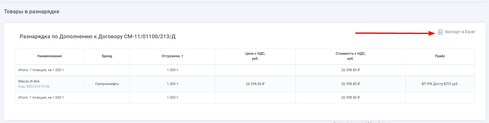
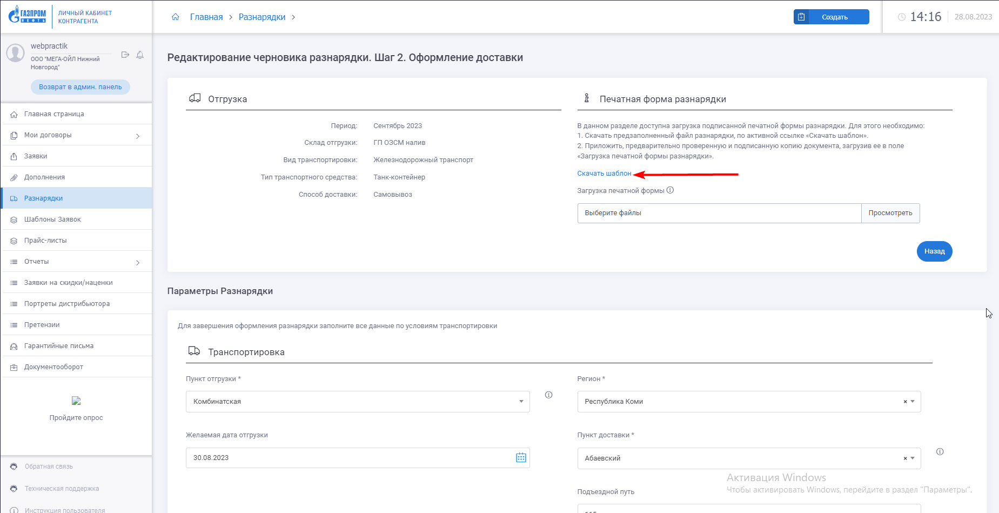

# Разнарядка										

Функциональность Разнарядок дает возможность пользователю системы (Контрагенту) сформировать разнарядку, чтобы заказать отгрузку продукции.  

Разнарядки создаются в системе на основе уже созданных Дополнений по всем активным Договорам, по которым есть законтрактованные объемы на текущий период.

Одна Разнарядка создаяётся для каждого транспорта.  
В одной разнарядке могут содержаться товары из нескольких дополнений

Разнарядки могут быть сформированы в двух системах:
- В ЛКК. В таком случае Разнарядки, созданные в ЛКК, передаются в АСКУ в обменном процессе
- В АСКУ. В таком случае Разнарядки, созданные в АСКУ, передаются в ЛКК в обменном процессе

## Создание Разнарядки
Контрагент может создавать разнарядки в ЛКК только при одновременном соблюдении ряда условий:
#### 1. Баланс по всем договорам больше или равен определенной сумме.  
  Размер доступной суммы единый для всех контрагентов и настраивается на стороне ЛКК.  
  Сравнение с доступной суммой происходит путем суммирования по всем договорам контрагента.  
  Для договоров типа «Аванс» учитываются аванс, у в Договорах типа «Отсрочка платежа» учитывается остаток по кредитному лимиту.  
#### 2. У контрагента нет Просроченной Дебиторской Задолженности (ПДЗ) по всем активным договорам.  
  Если у контрагента есть ПДЗ по одному или нескольким Договорам, то выполняется проверка флага «Блокировка Разнарядок при ПДЗ» в карточке контрагента:
  - Если флаг снят, то создание Разнарядок разрешено.
  - Если флаг установлен, то создание Разнарядок заблокировано.  

#### Этапы создания Разнарядки
Создание Разнарядки происходит в 3 этапа:  

1. Формирование списка продукции.
2. Запрос временного резерва.
3. Оформление разнарядки.
   
### 1. Формирование списка продукции
При создании разнарядки контрагент указывает следующие параметры:  
#### 1.1. Общие параметры  
- Период отгрузки – доступные периоды из Дополнений по всем активным Договорам, по которым есть законтрактованные объемы на текущий период. Возможно выбрать только один. 
- Склад отгрузки - доступные склады из Дополнений по всем активным Договорам, по которым есть законтрактованные объемы на текущий период. Возможно выбрать только один.
- Страна назначения – доступные страны назначения из Дополнений по всем активным Договорам, по которым есть законтрактованные объемы на текущий период. Отображается только у контрагентов типа «Экспорт». Возможно выбрать только одну страну. 
- Вид транспортировки. Вид транспортировки определяет список доступных типов транспортных средств и возможные направления доставки. Для вида «Железнодорожный транспорт» контрагент выбирает Пункт доставки из справочника «Пункты доставки». Для вида «Автомобильный транспорт» контрагент выбирает Адрес доставки из справочника «Адреса доставки».
- Тип транспортного средства – определяет объем товара или количество единиц.  
  Для фасованной продукции грузоподъемность выбранного типа ТС определяет объем товара, который можно добавить в одну разнарядку.  
  Для наливной продукции тип ТС определяет количество единиц ТС, требуемых для транспортировки указанного объема.
- Способ доставки. Определяет каким образом будет производиться доставка продукции: силами экспедитора или при помощи самовывоза.
- Дополнения – доступные Дополнения по всем активным Договорам, по которым есть законтрактованные объемы на текущий период. Возможен множественный выбор. 
#### 1.2. Параметры отгрузки  
- Дата отгрузки. 
- Пункт отгрузки. Список пунктов отгрузки формируется на основании выбранного склада отгрузки и вида транспортировки.
#### 1.3. Параметры доставки 
- Пункт доставки. Поле заполняется из справочника «пункты доставки». 
- Адрес доставки. Поле заполняется из справочника «Адреса доставки». Справочник отсортирован по алфавиту.
#### 1.4. Банковские реквизиты грузополучателя  

При выборе параметров происходит формирование списка доступных продуктов.  
В Разнарядку добавляются продукты только из тех Дополнений, у которых соответствующие параметры отвечают выбранным условиям.  
Если в Дополнении какие-то из параметров не указаны, эти Дополнения также доступны для добавления в Разнарядку.  

### 2. Запрос временного резерва
Для создания разнарядки контрагенту необходимо запросить и получить из системы АСКУ Временный резерв продукции (ВР). 
Временный резерв содержит доступные остатки по каждой SKU, которые зарезервированы за данным контрагентом и доступны для включения в Разнарядку.  
Данные о временных резервах передаются из АСКУ в двух случаях:
- По запросу контрагента.
- При внесении изменений во Временный резерв в АСКУ. К изменениям относятся: создание ВР, изменение объемов в существующем ВР, снятие ВР.

Временный резерв запрашивается в разрезе следующих параметров:
- контрагент,
- страна назначения (для контрагентов типа «Экспорт»),
- склад отгрузки,
- тип транспортировки,
- период,
- пункт доставки (для контрагентов с отличающимися условиями поставки).  
Все параметры являются обязательными.  
В разрезе перечисленных параметров в обеих системах может быть создан только один Временный резерв.  
При создании нового ВР все существующие резервы с теми же параметрами удаляются.
Временный резерв может быть предоставлен только при одновременном соблюдении двух условий:  
- Отсутствие у контрагента ПДЗ (по всем договорам).
- Наличие на счету доступной суммы N.  
  Размер доступной суммы единый для всех контрагентов и настраивается на стороне ЛКК.  
  Сравнение с доступной суммой происходит путем суммирования по всем договорам контрагента. Для Договоров типа «Аванс» учитываются аванс, в остаток по кредитному лимиту.  

Проверка по этим условиям осуществляется при попытке создания разнарядки пользователем.  

При формировании разнарядки баланс по договорам автоматически пересчитывается на стороне ЛКК, и после получения ответа о создании разнарядки из АСКУ обновленный баланс по версии АСКУ возвращается в ЛКК в обменном процессе по балансу, таким образом обеспечивается актуальность баланса по всем договорам на стороне ЛКК.  
#### Запрос временного резерва с отображением плановых поступлений
Запрос временного резерва и просмотр доступного резерва может быть осуществлен с отображением плановых поступлений.  
Для запроса ВР под план пользователь активирует чекбокс «С учетом плановых поступлений».   

Чекбокс «С учетом плановых поступлений» может быть заблокирован в том случае, если текущая дата не совпадает с доступным периодом резервирования продукции под план (активность периодов доступности резервирования продукции под план устанавливается в HL-блоке «Периоды доступности резервирования продукции «под план»»).  
В ином случае чекбокс доступен для активации.  

При активном чекбоксе «С учетом плановых поступлений» запрос временного резерва осуществляется с учетом планового поступления продукции, и при наличии плана поступления по продукции из временного резерва в интерфейсе товарной части разнарядки добавляется колонка «Плановые даты поступления продукции» с детализацией на N количество колонок – дат поступления продукции в формате ДД.ММ.ГГГГ.  

В строках таблицы (товарах) отображается количество продукции, планируемой к поступлению на определенную дату.  
Количество продукции отображается в единицах измерения: паллеты, тонны (вес брутто).  

Получение данных о плановых поступлениях происходит путем передачи запроса от ЛКК (при активации чекбокса) к АСКУ.  
АСКУ возвращает значение:  
0 – возврат резервов без плановых поступлений, в таком случае пользователю выводится сообщение (#УВ31);  
1 – возврат резервов с плановым поступлением продукции.  
#### Блокировка временного резерва по складу или пункту доставки  
Блокировка запроса Временного Резерва (ВР) необходима, чтобы ограничить возможность запроса новых ВР без созданий разнарядки.  
Для этого в системе реализуются следующие сценарии:
##### Установка блокировки
1. Контрагент запрашивает резерв. В ЛКК фиксируется факт запроса резерва и количество попыток таких запросов. Для дистрибьюторов экспорта запрос резерва фиксируется дополнительно в разрезе договора.
2. Если контрагент оформляет разнарядку, количество попыток обнуляется.
3. Если при запросе ВР по определенному складу отгрузки или пункту доставки (для контрагентов с поставками в несколько направлений), договору (для дистрибьюторов экспорта), количество попыток становится равным 3, происходят следующие события:
   - В интерфейсе создания разнарядки отобразится всплывающее окно с уведомлением.
   - Из ЛКК в АСКУ будет отправлен запрос на снятие всех временных резервов текущего контрагента по этому складу/пункту доставки.
   - Для дистрибьюторов с признаком «Экспорт» из ЛКК в АСКУ будет отправлен запрос на блокировку запроса Временного резерва в разрезе «Контрагент – Склад отгрузки -Договор». Для контрагентов с поставками в несколько направлений - «Контрагент – Склад отгрузки - Пункт доставки - Договор».
##### Снятие блокировки
Менеджер клиентского сервиса снимает блокировку в системе АСКУ. 
  После снятия из АСКУ в ЛКК передается информация о снятии блокировки.
  При этом в ЛКК происходят следующие события:
  - Блокировка для текущего контрагента и склада снимается.
  - Количество попыток обнуляется.

### 3. Оформление разнарядки
После формирования списка продукции и получения Временных резервов происходит непосредственно оформление Разнарядки.  
Правила оформления Разнарядки зависят в первую очередь от типа добавленной в Разнарядку продукции: фасовка или налив.
При оформлении Разнарядки пользователь может сохранить ее двумя способами:
#### 1) Сохранить как черновик. 
В этом случае:
  - Разнарядка сохраняется в ЛКК, но не передается в АСКУ. 
  - Состояние Временного резерва не меняется. Объемы, сохраненные в черновике, не удаляются из Временного Резерва и могут быть добавлены в Другую Разнарядку.
  - Пользователь может создать неограниченное количество черновиков, даже если суммарный объем в Черновиках превышает текущий Временный резерв.
#### 2) Отправить на согласование. 
В этом случае:
  - Разнарядка передается в АСКУ.
  - Разнаряженные объемы удаляются из Временного резерва на стороне АСКУ и обновленные данные по Резерву возвращаются в ЛКК.

### Снятие временного резерва
Временный резерв может быть снят при условии, что время жизни резевра истекло.  
Дата и время жизни резевра утаналивается на стороне АСКУ.  
В ЛКК записываетсяя в поле «Срок действия» в HL-блоке «Временные резервы». 

### Создание Разнарядки с продукцией типа «Фасовка»
Разнарядка для фасованной продукции создается на одно транспортное средство.  
Допустимый общий вес продукции в разнарядке определяется параметром «Грузоподъемность» выбранного типа транспортного средства.  
Так как в одно транспортное средство можно погрузить продукцию из разных Дополнений, в системе была предусмотрена двухуровневая структура хранения Разнарядок:  
#### 1) Разнарядки верхнего уровня.
Создаются пользователем и могут содержать товары из нескольких дополнений.
#### 2) Разнарядки второго уровня.
Создаются автоматически на основе разнарядки верхнего уровня.  
Разнарядка верхнего уровня разбивается на вложенные по количеству дополнений.  
Разбивается таким образом, чтобы вложенные разнарядки содержали товары только одного дополнения.

### Создание Разнарядки с продукцией типа «Налив»
Разнарядка для наливной продукции не ограничена количеством транспортных средств.  
В разнарядку для наливной продукции может быть включен только один продукт.  
Объем продукции ограничивается только временным резервом.

### Создание Разнарядки с продукцией в непаллетной норме
Разнарядка может содержать в себе продукцию в паллетной и непаллетной норме. 

#### Особенности Разнарядки с непаллетной нормой:
Для продукции с непаллетной нормой не требуется запрос временных резервов.  
Для добавления в разнарядку всегда доступен объем, указанный в Дополнении с непаллетной нормой.  
В случае если в Разнарядке есть один товар и в паллетной и в непаллетной норме, в интерфейсе он отображается в двух разных строках.  
В каждой строке пользователь указывает объем в соответствии с доступным способом фасовки – паллеты или штуки.  
Также в каждой строке выводится информация о соответствующем Дополнении, в котором был законтрактован текущий объем.  
При сохранении Разнарядки строки с одинаковым кодом продукта объединяются: количество штук переводится в паллеты в соответствии с паллетной нормой и складываются с объемом в паллетах. Объем в разнарядке сохраняется, как дробное число.

### Формирование excel-файла разнарядки														

При создании разнарядки в ЛКК, формируется Печатная форма разнарядки, которая представляет собой Excel-файл с информацией по разнарядке.
Excel-файл доступен для скачивания в интерфейсе ЛКК:  
1. По ссылке "Экспорт в Excel" на 1-м шаге создания разнарядки и на странице просмотра разнарядки
    
2. По ссылке "Скачать шаблон" в блоке "Печатная форма разнарядки" на втором шаге создания разнарядки
      

Также Excel-файл с информацией по разнарядке формируется на стороне ЛКК при отправке email-уведомления менеджеру КС о создании разнарядки.   
Email-уведомление отправляется менеджеру в том случае, если Разнарядка была создана в ЛКК и из АСКУ получены номера АСКУ всех разнарядок по Дополнению, которые включены в данную Разнарядку.  
Структура шаблона excel-файла строго регламентирована и зависит от типа продукции.  
В системе реализовано два типа шаблона Разнарядок:
1. Шаблон разнарядки для фасованной продукции.
2. Шаблон разнарядки для наливной продукции.  

#### Шаблон разнарядки для фасованной продукции 
Шаблон для фасованной продукции состоит из трех блоков:
1. Общие параметры Разнарядки на транспортное средство

a.	Публичный код разнарядки в формате «Исх. № <публичный код разнарядки>.
b.	Дата создания Разнарядки.
c.	Канал сбыта.
d.	Сегмент
e.	Вид доставки - заполняется данными из поля «Способ доставки» разнарядки.
f.	Пункт погрузки – Наименование пункта отгрузки.
g.	Контрагент – Наименование контрагента.
h.	Код контрагента - <Код SAP контрагента>.
i.	Номер Договора – список номеров Договоров, которые включены в разнарядку. Элементы списка разделяются знаком «;».
j.	Номер Дополнения – список Дополнений, которые включены в разнарядку. Элементы списка разделяются знаком «;».
k.	Грузополучатель – наименование грузополучателя, указанного в Разнарядке.
l.	Почтовый адрес грузополучателя – почтовый адрес грузополучателя, указанного в разнарядке (данные из справочника «Контрагенты»).
m.	Пункт назначения (город) – <Наименование пункта доставки>.
n.	Адрес доставки (включая пункт назначения) – <Наименование пункта доставки>, <Адрес доставки>.
o.	Контактное лицо в пункте назначения	- Фамилия и Имя грузополучателя, указанного в Разнарядке.
p.	Контактный телефон в пункте назначения – Телефон грузополучателя, указанного в Разнарядке.
q.	Код ОКПО грузополучателя – заполняется из соответствующего поля справочника «Контрагенты» для текущего грузополучателя. Заполняется в том случае, если тип транспортировки – ЖД-транспорт.
r.	Код грузополучателя – заполняется из соответствующего поля справочника «Контрагенты» для текущего грузополучателя. Заполняется в том случае, если тип транспортировки – ЖД-транспорт.
s.	Банковские реквизиты грузополучателя - <ИНН грузополучателя>; <КПП грузополучателя>; <расчетный счет грузополучателя>.
t.	Станция назначения – не заполняется.
u.	Код станции назначения – не заполняется.
v.	Подъездной путь/ветка – не заполняется.
w.	Отметка о согласии на отгрузку ранее сроков, установленных УЖТ, и оплату сбора за отгрузку ранее сроков, установленных УЖТ – не заполняется.
x.	Для кого (при необходимости указывается конечный получатель) – не заполняется.
y.	Часы работы склада (получателя/контрагента) – необязательно для заполнения. (Время, в которое Грузополучатель сможет принять доставку на своем складе.)
z.	Особые отметки – значение поля «Комментарий».

2. Таблица товаров

Таблица включает в себя список товаров по всем дополнениям, включенным в Разнарядку. Товары в таблице сортируются по Дополнению, внутри дополнения по названию. Таблица содержит следующие столбцы:

a.	Код продукта.
b.	Наименование материала в соответствии с договором. 
c.	Фасовка – тара продукции. Определение по Карточке продукта.
d.	Склад – место фасовки.
e.	Кол-во паллет (1л, 4л, 20л, 50л, 216,5л), коробок туб,фляг, 18 и 60 л – количество паллет в разнарядке.
f.	Кол-во коробок.
g.	Кол-во штук.
h.	вес нетто, кг (справочно) – вес нетто одной штуки продукции в килограммах.
i.	общий вес нетто, т (справочно) – общий вес нетто в тоннах.
j.	вес брутто, т (справочно) – вес брутто одной паллеты в тоннах.
k.	общий вес брутто, т (справочно) – общий вес брутто в тоннах.
l.	номер дополнения – юридический номер дополнения, которое содержит данный товар.

#### Шаблон разнарядки для наливной продукции

Шаблон разнарядки для наливной продукции состоит из двух блоков:

1.	Общие параметры Разнарядки на транспортное средство

a.	Публичный код разнарядки в формате «Исх. № <публичный код разнарядки>».
b.	Дата создания Разнарядки.  
c.	Пункт погрузки – Наименование пункта отгрузки.
d.	Вид доставки - заполняется данными из поля «Способ доставки» разнарядки.
e.	Тип ТС – заполняется данными из поля «Тип ТС» из разнарядки.
f.	Контрагент – Наименование контрагента.
g.	Номер Договора – <Номер договора> от <Дата начала действия договора>.
h.	Номер Дополнения – <юридический номер Дополнения> от <Дата создания Дополнения>.
i.	Наименование Товара (ГОСТ или ТУ) - <наименование товара>.
j.	Количество, ед. изм. - <Количество в тоннах> тонн.
k.	Грузополучатель – наименование грузополучателя, указанного в Разнарядке.
l.	Адрес, номер телефона/ факса Грузополучателя – адрес доставки, номер телефона грузополучателя, фамилия и имя грузополучателя из разнарядки.
m.	Банковские реквизиты грузополучателя - <ИНН грузополучателя>; <КПП грузополучателя>; <расчетный счет грузополучателя>.
n.	Код ОКПО грузополучателя – заполняется из соответствующего поля справочника «Контрагенты» для текущего грузополучателя. Заполняется для авто и жд транспорта.
o.	Код грузополучателя – заполняется из поля «Код грузополучателя РЖД» справочника «Контрагенты» по выбранному в разнарядке грузополучателю. 
p.	Станция назначения – не заполняется для отгрузки автотранспортом. Для отгрузки ЖД транспортом поле заполняется значением «Пункт доставки» из разнарядки.
q.	Код станции назначения – для отгрузки ЖД транспортом заполняется значением из поля «Код станции назначения» в HL блоке «Пункты доставки». Для отгрузки автотранспортом не заполняется.
r.	Подъездной путь/ветка – не заполняется.
s.	Для кого – не заполняется.
t.	Перевозка по транзитным дорогам: - наименование перевозчиков по территории транзитных дорог и страны назначения;- наименование и коды станций, между которыми работают перевозчики – не заполняется.
u.	Отметка о согласии на отгрузку ранее сроков, установленных УЖТ, и оплату сбора за отгрузку ранее сроков, установленных УЖТ – не заполняется.
v.	Особые отметки – значение поля «Комментарий».

2.	Место дополнительной информации. Не редактируемая область, которая включает в себя поля печатной формы, места для подписей и печатей.

3. Место дополнительной информации. Не редактируемая область, которая включает в себя поля печатной формы, места для подписей и печатей.

###	Формирование Разнарядки с продукцией в непаллетной норме

Разнарядка может содержать в себе продукцию в паллетной и непаллетной норме. 

Особенности Разнарядки с непаллетной нормой:

1.	Для продукции с непаллетной нормой не требуется запрос временных резервов. Для добавления в разнарядку всегда доступен объем, указанный в Дополнении с непаллетной нормой.
2.	В случае если в Разнарядке есть один товар и в паллетной и в непаллетной норме, в интерфейсе он отображается в двух разных строках. В каждой строке пользователь указывает объем в соответствии с доступным способом фасовки – паллеты или штуки. Также в каждой строке выводится информация о соответствующем Дополнении, в котором был законтрактован текущий объем.
3.	При сохранении Разнарядки строки с одинаковым кодом продукта объединяются: количество штук переводится в паллеты в соответствии с паллетной нормой и складываются с объемом в паллетах. Объем в разнарядке сохраняется, как дробное число.

### Статусная схема Разнарядки
Жизненный цикл Разнарядки может выглядеть следующим образом:

№|Статус|Описание статуса|Уведомление о присвоении статуса
:-:|:-|:-|:-
1|Черновик|
Статус присваивается на основании факта создания Разнарядки в ЛКК

Статус присваивается в ЛКК
Контрагенту доступно редактирование Разнарядки.|
2|На согласовании|
Статус присваивается на основании факта отправки Разнарядки на согласование из ЛКК в АСКУ

Статус присваивается в ЛКК
Контрагенту доступно редактирование Разнарядки|Уведомление отправляется менеджеру КС из ЛКК
3|ТС формируется|
Статус передается из АСКУ после того, как для разнарядки было создано Задание на перевозку

Данный статус присваивается, только если вид транспортировки – авто и тип продукции - фасовка. Для Ж/Д и автоналива данный статус не передается
Контрагенту не доступно редактирование Разнарядки|Уведомление отправляется контрагенту из ЛКК
4|Отправлено на отгрузку|
Статус передается из АСКУ после того, как транспортное средство найдено

Данный статус присваивается для всех видов транспортировки и типов продукции
Контрагенту не доступно редактирование Разнарядки|Уведомление отправляется контрагенту из ЛКК  
5|Отгружено|
Статус передается из АСКУ после завершения отгрузки
Контрагенту не доступно редактирование Разнарядки|
6|Отклонено|
Статус присваивается в случае, если Разнарядка отклонена, дальнейшие действия по Разнарядке не предусматриваются

Статус присваивается в АСКУ и передается в ЛКК
Контрагенту не доступно редактирование Разнарядки|Уведомление отправляется контрагенту из ЛКК

### Разнарядки в обменном процессе
Разнарядка может быть создана как контрагентом в ЛКК, так и менеджером в АСКУ.  

Между ЛКК и АСКУ реализован обмен данными, который позволяет поддерживать актуальную информацию о Разнарядках в обеих системах.  

Из ЛКК в АСКУ отправляются созданные разнарядки по Дополнении. В структуре данных передается также публичный код верхнеуровневой разнарядки для сохранения логической структуры на стороне АСКУ.

Из АСКУ в ЛКК в едином обменном процессе отправляется созданная Разнарядка по Дополнению с публичным кодом верхнеуровневой Разнарядки.  
- Если код был передан и найден в ЛКК, Разнарядка привязывается к соответствующей Разнарядке верхнего уровня;
- Если Код не был передан или не найден, то в ЛКК формируется новая Разнарядка верхнего уровня.  

### Архитектура данных Разнарядок
Для реализации функциональности в системе созданы следующие справочники:  
- Разнарядки (highload-блок).
- Разнарядки по Дополнению (highload-блок).
- Товары в Разнарядке (highload-блок).