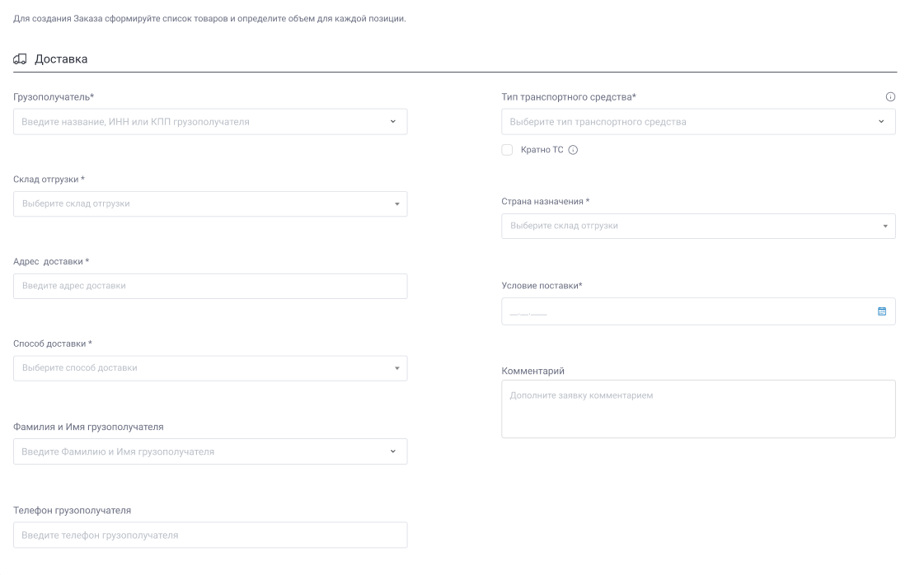
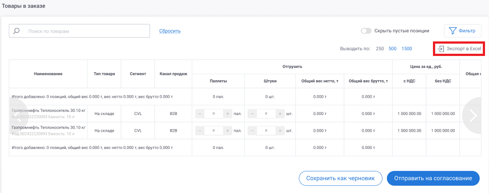

# Заказ										

Функциональность Заказов дает возможность пользователю системы (Контрагенту) сформировать Заказ, чтобы заказать отгрузку продукции.  

Разнарядки создаются в системе на основе активных Договоров, по которым есть законтрактованные объемы на текущий период.

Один Заказ создаяётся для каждого транспорта.  

Разнарядки могут быть сформированы в двух системах:
- В ЛКК. В таком случае Заказы, созданные в ЛКК, передаются в АСКУ в обменном процессе
- В АСКУ. В таком случае Заказы, созданные в АСКУ, передаются в ЛКК в обменном процессе

## Создание Заказа
Контрагент может создавать заказы в ЛКК только при одновременном соблюдении ряда условий:
#### 1. Баланс по всем договорам больше или равен определенной сумме.  
  Размер доступной суммы единый для всех контрагентов и настраивается на стороне ЛКК.  
  Сравнение с доступной суммой происходит путем суммирования по всем договорам контрагента.  
  Для договоров типа «Аванс» учитываются аванс, у в Договорах типа «Отсрочка платежа» учитывается остаток по кредитному лимиту.  
#### 2. У контрагента нет Просроченной Дебиторской Задолженности (ПДЗ) по всем активным договорам.  
  Если у контрагента есть ПДЗ по одному или нескольким Договорам, то выполняется проверка флага «Блокировка Заказов при ПДЗ» в карточке контрагента:
  - Если флаг снят, то создание Заказов разрешено.
  - Если флаг установлен, то создание Заказов заблокировано.  

#### Этапы создания Заказов
Создание Разнарядки происходит в 3 этапа:  

1. Формирование списка продукции.
2. Запрос временного резерва.
3. Оформление заказа.
   
### 1. Формирование списка продукции ???
При создании заказа контрагент указывает следующие параметры:  

- Грузополучатель – Выпадающий список, в котором доступен выбор грузополучателя. В списке содержатся все грузополучатели текущего контрагента. 
- Адрес доставки - Выпадающий список, в котором доступен выбор адресов доставки. В списке содержаться все адреса доставки определенного контрагента. Адреса доставки отсортированы в алфавитном порядке. По умолчанию установлен первый адрес доставки в списке.
- Способ доставки – Выпадающий список, в котором доступен выбор способов доставки. 
Список содержит следующие способы доставки:

1.	Самовывоз

2.	Силами экспедитора

По умолчанию установлен способ – «Силами экспедитора».

- Фамилия и имя грузополучателя - Выпадающий список с возможностью ввода нового значения, который содержит три последних записи, введенных контрагентом. В заявке сохраняется не идентификатор, а введенное значение
- Телефон грузополучателя – Выпадающий список с возможностью ввода нового значения, который содержит три последних записи, введенных контрагентом. В заказе сохраняется не идентификатор, а введенное значение.
- Кратно ТС – Чекбокс, для определения принципа работы с ограничением грузоподьёмности ТС. По умолчанию не установлен.
 Флаг устанавливается на усмотрение контрагента. 
 
 Если флаг не установлен -допустимый общий вес брутто продукции в заказе определяется параметром «Грузоподъемность» выбранного типа транспортного средства:
 
 При вводе количества товара, общий вес брутто которого больше грузоподъёмности ТС, всплывает модальное окно с текстом «Для выбранного вида транспортировки допустимый вес не может превышать <грузоподъёмность ТС> т» и кнопкой «ОК».
 
 Если флаг установлен – исходя из типа ТС, определяется вхождение тоннажа брутто в доступный диапазон.
 
 Если тоннаж брутто превышает грузоподъёмность выбранного авто, то заказ разбивается на несколько заказов. Количество заказов = кол-ву ТС выбранного типа, необходимых для перевозки тоннажа брутто заказанной продукции.
 
 Разделение фасованной продукции по заказам производится с точностью до 1 паллеты.
 
 Разделение непаллетной продукции по заказам производится с точностью до 1 шт.
 
 Разделение наливной продукции по заказам производится с точностью до 1 кг. 
  
- Тип транспортного средства - 
Выпадающий список, содержит типы ТС для выбранного вида транспортировки.

Для фасованной продукции тип ТС влияет на максимальный объем продукции в заказе.

В списке выводятся только те типы ТС, которые относятся к выбранному виду транспортировки и складу отгрузки.

- Условие поставки - 
 Поле для ввода или отображения даты получения или отгрузки заказа.

Отображение поля, зависит от того, какое значение стоит у контрагента 

- Стоит значение «до»    - контрагент не может выбрать желаемую дату поставки. Поле заблокировано для ввода

- Стоит значение «В» - контрагент может выбрать одну конкретную дату. Но не более конца следующего месяца.

- Стоит значение «В временное окно» - контрагент может выбрать период «С» «По». С возможностью выбора даты и времени.

- Стоит значение «До» - Контрагент может выбрать дату, до которой необходимо доставить продукт, но не более конца следующего месяца.

Стоит значение «ДО» - поле не отображается.

- Страна назначения - доступные страны назначения по всем активным Договорам, по которым есть законтрактованные объемы на текущий период. Отображается только у контрагентов типа «Экспорт». Возможно выбрать только одну страну. 
- Комментарий - Текстовое поле для ввода комментария.

При выборе параметров происходит формирование списка доступных продуктов.  

### 2. Запрос временного резерва

Для создания заказа контрагенту необходимо запросить и получить из системы АСКУ Временный резерв продукции (ВР). 

Временный резерв содержит доступные остатки по каждой SKU, которые зарезервированы за данным контрагентом и доступны для включения в Заказ.  

Данные о временных резервах передаются из АСКУ в двух случаях:

- По запросу контрагента.

- При внесении изменений во Временный резерв в АСКУ. К изменениям относятся: создание ВР, изменение объемов в существующем ВР, снятие ВР.

Временный резерв запрашивается в разрезе следующих параметров:

- контрагент,
- страна назначения (для контрагентов типа «Экспорт»),
- склад отгрузки,
- тип транспортировки,
- условие поставки,
- пункт доставки (для контрагентов с отличающимися условиями поставки).  

Все параметры являются обязательными.  

В разрезе перечисленных параметров в обеих системах может быть создан только один Временный резерв.  

При создании нового ВР все существующие резервы с теми же параметрами удаляются.

Временный резерв может быть предоставлен только при одновременном соблюдении двух условий:  

- Отсутствие у контрагента ПДЗ (по всем договорам).
- Наличие на счету доступной суммы N.  
  Размер доступной суммы единый для всех контрагентов и настраивается на стороне ЛКК.  
  Сравнение с доступной суммой происходит путем суммирования по всем договорам контрагента. Для Договоров типа «Аванс» учитываются аванс, в остаток по кредитному лимиту.  

Проверка по этим условиям осуществляется при попытке создания заказа пользователем.  

При формировании разнарядки баланс по договорам автоматически пересчитывается на стороне ЛКК, и после получения ответа о создании разнарядки из АСКУ обновленный баланс по версии АСКУ возвращается в ЛКК в обменном процессе по балансу, таким образом обеспечивается актуальность баланса по всем договорам на стороне ЛКК.  

#### Запрос временного резерва с отображением плановых поступлений

Запрос временного резерва и просмотр доступного резерва может быть осуществлен с отображением плановых поступлений.  

Для запроса ВР под план пользователь активирует чекбокс «С учетом плановых поступлений».   

Чекбокс «С учетом плановых поступлений» может быть заблокирован в том случае, если текущая дата не совпадает с доступным периодом резервирования продукции под план (активность периодов доступности резервирования продукции под план устанавливается в HL-блоке «Периоды доступности резервирования продукции «под план»»).  

В ином случае чекбокс доступен для активации.  

При активном чекбоксе «С учетом плановых поступлений» запрос временного резерва осуществляется с учетом планового поступления продукции, и при наличии плана поступления по продукции из временного резерва в интерфейсе товарной части разнарядки добавляется колонка «Плановые даты поступления продукции» с детализацией на N количество колонок – дат поступления продукции в формате ДД.ММ.ГГГГ.  

В строках таблицы (товарах) отображается количество продукции, планируемой к поступлению на определенную дату.  
Количество продукции отображается в единицах измерения: паллеты, тонны (вес брутто).  

Получение данных о плановых поступлениях происходит путем передачи запроса от ЛКК (при активации чекбокса) к АСКУ.  
АСКУ возвращает значение:  

0 – возврат резервов без плановых поступлений, в таком случае пользователю выводится сообщение (#УВ31);  

1 – возврат резервов с плановым поступлением продукции.  

#### Блокировка временного резерва по складу или пункту доставки  

Блокировка запроса Временного Резерва (ВР) необходима, чтобы ограничить возможность запроса новых ВР без созданий разнарядки.  

Для этого в системе реализуются следующие сценарии:

##### Установка блокировки

1. Контрагент запрашивает резерв. В ЛКК фиксируется факт запроса резерва и количество попыток таких запросов. Для дистрибьюторов экспорта запрос резерва фиксируется дополнительно в разрезе договора.

2. Если контрагент оформляет разнарядку, количество попыток обнуляется.

3. Если при запросе ВР по определенному складу отгрузки или пункту доставки (для контрагентов с поставками в несколько направлений), договору (для дистрибьюторов экспорта), количество попыток становится равным 3, происходят следующие события:
 
   -   - В интерфейсе создания разнарядки отобразится всплывающее окно с уведомлением.
   - Из ЛКК в АСКУ будет отправлен запрос на снятие всех временных резервов текущего контрагента по этому складу/пункту доставки.
   - Для дистрибьюторов с признаком «Экспорт» из ЛКК в АСКУ будет отправлен запрос на блокировку запроса Временного резерва в разрезе «Контрагент – Склад отгрузки -Договор». 
   
Для контрагентов с поставками в несколько направлений - «Контрагент – Склад отгрузки - Пункт доставки - Договор».

##### Снятие блокировки

Менеджер клиентского сервиса снимает блокировку в системе АСКУ. 

  После снятия из АСКУ в ЛКК передается информация о снятии блокировки.

  При этом в ЛКК происходят следующие события:

  - Блокировка для текущего контрагента и склада снимается.
  - Количество попыток обнуляется.

### 3. Оформление Заказа

После формирования списка продукции и получения Временных резервов происходит непосредственно оформление Заказа.  

Правила оформления Заказа зависят в первую очередь от типа добавленной в Заказ продукции: фасовка или налив.

При оформлении Разнарядки пользователь может сохранить ее двумя способами:

#### 1. Сохранить как черновик. 

В этом случае:

  - Заказ сохраняется в ЛКК, но не передается в АСКУ. 
  - Состояние Временного резерва не меняется. Объемы, сохраненные в черновике, не удаляются из Временного Резерва и могут быть добавлены в другой Заказ.
  - Пользователь может создать неограниченное количество черновиков, даже если суммарный объем в Черновиках превышает текущий Временный резерв.

#### 2. Отправить на согласование. 

В этом случае:

  - Происходит расчёт даты доставки для контрагентов с условиями поставки «до».
  - Происходит финансовая проверка: 
1. Если договор Предоплатный, происходит проверка на наличие Денежных средств. 
 
2. Если договор Постоплатный, происходит проверка, что сумма заказа не превышает остаток по КЛ.
 
  - Происходит проверка на Минимальный размер заказа: 
Если суммарный вес брутто всех товаров в заказе меньше, чем значение в параметре «Минимальный тоннаж заказа» в HL-блоке «Контрагенты», то всплывает модальное окно с текстом «Допустимый вес должен превышать <Минимальный тоннаж заказа> т» и кнопкой «ОК». 

  - Происходит проверка на Тип заказа: 
1. Если тип заказа «Стандартный», то результат расчёта даты доставки не изменяется.

2. Если тип заказа «Срочный», то результат расчёта даты доставки (?)  

  - Если все проверки пройдены Заказ передается в АСКУ.
  - Разнаряженные объемы удаляются из Временного резерва на стороне АСКУ и обновленные данные по Резерву возвращаются в ЛКК.
  
### Копирование заказа

При копировании заказа происходит переход на страницу создания нового Заказа, на которой уже заполнены значения  всех полей из Заказа, выбранного для копирования, кроме номера заказа, комментария, даты поставки, параметров из АСКУ (условия поставки, склад отгрузки, тип товара). 

При копировании заказа на странице создания заказа, происходят  проверки:

1) Проверка доступности значений из заказа-источника: 

Если значение поля из заказа-источника не доступно на текущий момент для заказа-копии, то значение в этом поле обнуляется.

Например, если в заказе-источнике был указан грузополучатель, отсутствующий у контрагента на момент создания заказа-копии, то поле «Грузополучатель» в заказе-копии должно быть пустым.

Реализовано для следующих полей заказа:

- Грузополучатель
- Кратно ТС
- Тип транспортного средства
- Комментарий
- Таблица со списком товаров.

2) Пересчёт поля «Дата поставки» от даты создания заказа-копии и по условиям  поставки, актуальным для контрагента на момент создания заказа-копии. 

### Снятие временного резерва
Временный резерв может быть снят при условии, что время жизни резевра истекло.  
Дата и время жизни резевра утаналивается на стороне АСКУ.  
В ЛКК записываетсяя в поле «Срок действия» в HL-блоке «Временные резервы». 

### Создание Заказа с продукцией типа «Фасовка»
Заказ для фасованной продукции создается на одно транспортное средство.  
Если флаг "Кратно ТС" не установлен - допустимый общий вес продукции в Заказе определяется параметром «Грузоподъемность» выбранного типа транспортного средства: 
При вводе количества товара, общий вес брутто которого больше грузоподъёмности ТС, всплывает модальное окно с текстом «Для выбранного вида транспортировки допустимый вес не может превышать <грузоподъёмность ТС> т» и кнопкой «ОК».
Допустимый общий вес продукции в Заказе определяется параметром «Грузоподъемность» выбранного типа транспортного средства.  
Если установлен флаг "Кратно ТС" – исходя из типа ТС, определяется вхождение тоннажа брутто в доступный диапазон.
Если тоннаж брутто превышает грузоподъёмность выбранного авто, то заказ разбивается на несколько заказов. Количество заказов = кол-ву ТС выбранного типа, необходимых для перевозки тоннажа брутто заказанной продукции.
Разделение фасованной продукции по заказам производится с точностью до 1 паллеты.
Разделение непаллетной продукции по заказам производится с точностью до 1 шт.
Разделение наливной продукции по заказам производится с точностью до 1 кг.

### Создание Заказа с продукцией типа «Налив»
Заказ для наливной продукции не ограничена количеством транспортных средств.  
В разнарядку для наливной продукции может быть включен только один продукт.  
Объем продукции ограничивается только временным резервом.

### Создание Разнарядки с продукцией в непаллетной норме
Разнарядка может содержать в себе продукцию в паллетной и непаллетной норме. 

#### Особенности Разнарядки с непаллетной нормой:
Для продукции с непаллетной нормой не требуется запрос временных резервов.  
Для добавления в разнарядку всегда доступен объем, указанный в Дополнении с непаллетной нормой.  
В случае если в Разнарядке есть один товар и в паллетной и в непаллетной норме, в интерфейсе он отображается в двух разных строках.  
В каждой строке пользователь указывает объем в соответствии с доступным способом фасовки – паллеты или штуки.  
Также в каждой строке выводится информация о соответствующем Дополнении, в котором был законтрактован текущий объем.  
При сохранении Разнарядки строки с одинаковым кодом продукта объединяются: количество штук переводится в паллеты в соответствии с паллетной нормой и складываются с объемом в паллетах. Объем в разнарядке сохраняется, как дробное число.

### Формирование excel-файла Заказа														

При создании Заказа в ЛКК, формируется его печатная форма, которая представляет собой Excel-файл с информацией по Заказу. 
Поля печатной формы заполняются данными со страницы заказа. Если данные для поля по каким-то параметрам на странице отсутствуют, то поле остаётся пустым.
Excel-файл доступен для скачивания в интерфейсе ЛКК по ссылке "Экспорт в Excel" на страницах создания, просмотра и редактировании Заказа.

 

 
Структура шаблона excel-файла строго регламентирована и зависит от типа продукции.  

В системе реализовано два типа шаблона Заказов:

1. Шаблон разнарядки для фасованной продукции.
2. Шаблон разнарядки для наливной продукции.  

#### Шаблон заказа для фасованной продукции 

Шаблон для фасованной продукции состоит из:

1. Общие параметры Заказа на транспортное средство

a.	Публичный код заказа в формате «Исх. № <публичный код заказа>.

b.	Дата создания Заказа.

c.	Вид доставки - заполняется данными из поля «Способ доставки» заказа.

d.	Пункт погрузки – наименование пункта отгрузки.

e.	Контрагент – Наименование контрагента.

f.	Код контрагента - <Код SAP контрагента>.

g.	Номер Договора – список номеров Договоров, которые включены в заказ. Элементы списка разделяются знаком «;».

h.	Грузополучатель – наименование грузополучателя, указанного в Заказе.

i.	Почтовый адрес грузополучателя – почтовый адрес грузополучателя, указанного в заказе (данные из справочника «Контрагенты»).

j.	Пункт доставки (город) – <Наименование пункта доставки>.

k.	Адрес доставки (включая пункт назначения) – <Наименование пункта доставки>, <Адрес доставки>.

l.	Фамилия и имя грузополучателя	- Фамилия и Имя грузополучателя, указанного в Заказе.

m.	Контактный телефон грузополучателя – Телефон грузополучателя, указанного в Заказе.

n.	Код ОКПО грузополучателя – заполняется из соответствующего поля справочника «Контрагенты» для текущего грузополучателя. Заполняется в том случае, если тип транспортировки 
– ЖД-транспорт.

o.	Код грузополучателя – заполняется из соответствующего поля справочника «Контрагенты» для текущего грузополучателя. Заполняется в том случае, если тип транспортировки – ЖД-транспорт.

p.	Банковские реквизиты грузополучателя - <ИНН грузополучателя>; <КПП грузополучателя>; <расчетный счет грузополучателя>.

q.	Станция назначения – не заполняется.

r.	Код станции назначения – не заполняется.

s.	Подъездной путь/ветка – не заполняется.

t.	Для кого (при необходимости указывается конечный получатель) – не заполняется.

u.	Особые отметки – значение поля «Комментарий».

2.	Таблица товаров. 
Таблица содержит следующие столбцы:

a.	Код продукта

b.	Наименование материала в соответствии с договором. Указано наименование продукции, Емкость товара.

c.	Тип товара.

d.	Фасовка - тара продукции. Определение по Карточке продукта.

e.	Объем. Для фасованной продукции объем выводится в два столбца: Паллеты, Штуки.

f.	Общий вес нетто, т (справочно) – общий вес нетто в тоннах.

g.	вес брутто, т (справочно) – вес брутто одной паллеты в тоннах.

h.	Общий вес брутто, т (справочно) – общий вес брутто в тоннах.

i.	Цена за ед., валюта. - Колонка имеет детализацию на 2 колонки: «с НДС», «без НДС».

j.	Общая стоимость с НДС, валюта. 

k.	Размер НДС, руб. 

l.	Сегмент. 

m.	Канал продаж.

3.	Место дополнительной информации. Не редактируемая область, которая включает в себя поля печатной формы, места для подписей и печатей.

#### Шаблон Заказа для наливной продукции

Шаблон Заказа для наливной продукции состоит из:

1.	Общие параметры Заказа на транспортное средство

a.	Публичный код заказа в формате «Исх. № <публичный код заказа>».

b.	Дата создания заказа.  

c.	Вид доставки - заполняется данными из поля «Способ доставки» заказа.

d.	 Пункт погрузки – наименование пункта отгрузки.

e.	Тип ТС – заполняется данными из поля «Тип ТС» из заказа.

f.	 Контрагент – Наименование контрагента.

g.	Код контрагента - <Код SAP контрагента>.

h.	 Номер Договора – список номеров Договоров, которые включены в заказ. Элементы списка разделяются знаком «;».

i.	Грузополучатель – наименование грузополучателя, указанного в заказе.

j.	 Почтовый адрес грузополучателя – почтовый адрес грузополучателя, указанного в заказе (данные из справочника «Контрагенты»).

k.	Пункт доставки (город) – <Наименование пункта доставки>.

l.	Адрес доставки (включая пункт назначения) – <Наименование пункта доставки>, <Адрес доставки>.

m.	Фамилия и имя грузополучателя	- Фамилия и Имя грузополучателя, указанного в Заказе.

n.	Контактный телефон грузополучателя – Телефон грузополучателя, указанного в Заказе.

o.	Код ОКПО грузополучателя – заполняется из соответствующего поля справочника «Контрагенты» для текущего грузополучателя. Заполняется в том случае, если тип транспортировки 
– ЖД-транспорт.

p.	Код грузополучателя – заполняется из соответствующего поля справочника «Контрагенты» для текущего грузополучателя. Заполняется в том случае, если тип транспортировки – 
ЖД-транспорт.

q.	Банковские реквизиты грузополучателя - <ИНН грузополучателя>; <КПП грузополучателя>; <расчетный счет грузополучателя>.

r.	Станция назначения – не заполняется.

s.	Код станции назначения – не заполняется.

t.	Подъездной путь/ветка – не заполняется.

u.	Для кого (при необходимости указывается конечный получатель) – не заполняется.

v.	Перевозка по транзитным дорогам: 

- наименование перевозчиков по территории транзитных дорог и страны назначения;

- наименование и коды станций, между которыми работают перевозчики.

w.	Особые отметки – значение поля «Комментарий».

2.	Место дополнительной информации. Не редактируемая область, которая включает в себя поля печатной формы, места для подписей и печатей.

###	Формирование Заказа с продукцией в непаллетной норме

Заказ может содержать в себе продукцию в паллетной и непаллетной норме. 

Особенности Заказа с непаллетной нормой:

1.	В случае если в Заказе есть один товар и в паллетной и в непаллетной норме, в интерфейсе он отображается в двух разных строках. В каждой строке пользователь указывает 
объем в соответствии с доступным способом фасовки – паллеты, штуки, бочка. 

2.	При сохранении Заказа строки с одинаковым кодом продукта объединяются: количество штук переводится в паллеты в соответствии с паллетной нормой и складываются с объемом в паллетах. Объем в заказе сохраняется, как дробное число.

### Статусная схема Разнарядки
Жизненный цикл Разнарядки может выглядеть следующим образом:

№|Статус|Описание статуса
:-:|:-|:-
1.	|	Черновик	Статус присваивается Заказу при создании Заказа в ЛКК.
2.	|	На согласовании	|Статус присваивается Заказу в случае, если пользователь ЛКК отправил Заказ на согласование в АСКУ.
3.	|	Ожидает оплаты|	Статус присваивается Заказу в ЛКК, при негативном результате финансовой проверки контрагента.
4.	|	Подтверждено	|Статус присваивается Заказу в ЛКК при получении его из АСКУ.
5.	|	Поиск авто	|Статус присваивается Заказу в ЛКК при получении его из АСКУ. 
6.	|	Отправлено на погрузку |	Статус присваивается Заказу в ЛКК при получении его из АСКУ.
7.	|	Отклонено	|Статус присваивается Заказу в ЛКК при получении его из АСКУ.
8.	|	Отгружено|	Статус присваивается Заказу в ЛКК при получении его из АСКУ.
9.	|	Получено	|Статус присваивается Заказу в ЛКК при подтверждении заказником в интерфейсе ЛКК факта прибытия Заказа.

### Заказы в обменном процессе
Заказ может быть создана как контрагентом в ЛКК, так и менеджером в АСКУ.  

Между ЛКК и АСКУ реализован обмен данными, который позволяет поддерживать актуальную информацию о Заказах в обеих системах.  

Из ЛКК в АСКУ отправляются созданные Заказы. В структуре данных передается также публичный код Заказа для сохранения логической структуры на стороне АСКУ.

Из АСКУ в ЛКК в едином обменном процессе отправляется созданный Заказ с публичным кодом Заказа.  

- Если код был передан и найден в ЛКК, Заказ привязывается к соответствующему Заказу верхнего уровня;
- Если Код не был передан или не найден, то в ЛКК формируется новый Заказы верхнего уровня.  

### Архитектура данных Заказов

Для реализации функциональности в системе созданы следующие справочники:  

- Заказы (highload-блок).
- Заказы. Товары (highload-блок).
- Заказы. Окончание корректировок (highload-блок).
- 