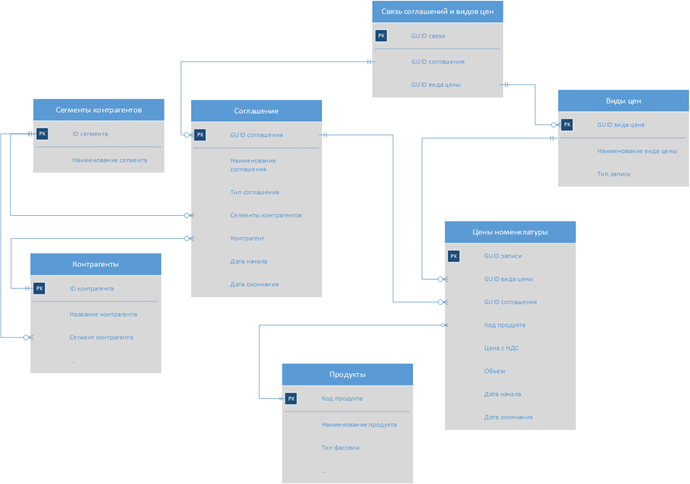

# Архитектура Ценообразования

Архитектура Ценообразования описывает структуру набора данных, которая обеспечивает наличие в системе актуальных цен для продуктов. 

Каждый продукт в системе может иметь одновременно несколько цен. Применение той или иной цены зависит от нескольких параметров:

-	Тип цены: Цены могут быть базовые и Специальные. Базовые цены хранятся в Типовых соглашениях, спец. цены хранятся в Индивидуальных Соглашениях.
-	Период действия Ценового Соглашения или Цен номенклатуры.

Архитектура Ценообразования применяется в ЛКК на этапе создания Проекта Дополнения. В этот момент пользователь выбирает Ценовое Соглашение для каждого продукта, добавленного в проект Дополнения. 

## Типовые ценовые соглашения

Типовые Соглашения определяют базовые или минимальные цены для каждой номенклатуры. 

Параметры Типовых Соглашений в рамках ЛКК:

-	Типовые соглашения действуют в разрезе сегментов контрагента. Каждое типовое соглашение может принадлежать к одному или нескольким сегментам.
-	Типовые Соглашения могут действовать только в разрезе определенного склада отгрузки. На продукцию других складов данные цены не распространяются.
-	В рамках одного Сегмента Контрагента может действовать одновременно несколько Типовых Соглашений. Количество Типовых Соглашений не ограничено.
-	Каждый продукт в рамках одного Сегмента контрагента может иметь только одну базовую цену, то есть может находиться только в одном Типовом Соглашении. За консистентность данных отвечает мастер-система (АСКУ). 

###	 Установка цен в Типовых Соглашениях

Цены в Типовых соглашениях устанавливаются через справочник «Виды цен»:

1.	Типовое соглашение может включать в себя только один Вид цены. 
2.	Каждый Вид цены может распространяться на неограниченное количество Типовых соглашений.
3.	Вид цены может включать в себя неограниченное количество Цен номенклатуры.

##	Индивидуальные ценовые соглашения

Индивидуальные Соглашения определяют специальные цены, которые были сформированы под определенный перечень продукции для конкретного контрагента. Индивидуальные Соглашения имеют ограниченный срок действия. 

Параметры Индивидуальных Соглашений в рамках ЛКК:

-	Индивидуальные Соглашения действуют в разрезе одного контрагента. Одно Инд. Соглашение не может быть применено к нескольким контрагентам
-	Индивидуальные соглашения могут быть привязаны к складу:
-	Если склад указан, то Соглашение действует только в разрезе определенного склада отгрузки. На продукцию других складов данные цены не распространяются.
-	Если склад не указан, то Соглашение действует на всех складах.
-	Для одного контрагента может действовать одновременно насколько Инд. Соглашений. Количество Инд. Соглашений не ограничено.
-	Каждый продукт может одновременно иметь несколько спеццен, то есть принадлежать к разным Инд. Соглашениям.
-	Инд. Соглашения обязательно имеют дату начала действия и дату окончания действия соглашения.

### Установка цен в Индивидуальном соглашении

Цены на продукцию могут устанавливаться в одном из трех режимов:

1.	Установка цен через «Вид цены»:

1.1.	Инд. Соглашение может включать в себя только один вид цены.

1.2.	Каждый Вид цены может распространяться на неограниченное количество Индивидуальных соглашений.

1.3.	Вид цены может включать в себя неограниченное количество цен номенклатуры.

1.4.	Каждая Цена номенклатуры может иметь собственный период действия.

1.5.	Каждая Цена номенклатуры может иметь ограничение по объему, действующее для текущей цены.

2.	Установка цен через «Ценовые группы»:

2.1.	Инд. Соглашение напрямую включает в себя неограниченное количество цен номенклатуры.

2.2.	Каждая Цена номенклатуры имеет период действия, унаследованный от Инд. Соглашения.

3.	Установка цен через Согласования:

3.1.	Инд. Соглашение может включать в себя несколько Согласований.

3.2.	Согласование представляет собой документ, который имеет идентификатор – Номер согласования.

3.3.	Каждое Согласование может включать в себя неограниченное количество цен номенклатуры.

3.4.	Каждая Цена номенклатуры может иметь собственный период действия.

3.5.	Каждая Цена номенклатуры может иметь ограничение по объему, действующее для текущей цены.

3.6.	Каждая Цена номенклатуры может находиться в нескольких Согласованиях в рамках одного Ценового Соглашения.

В системе есть возможность запросить отчет по скидкам/наценкам, актуальный на текущий момент. Отчет формируется в АСКУ по онлайн-запросу от пользователя в ЛКК. Сформированный отчет передается в ЛКК в обменном процессе. 

Сформированный отчет содержит в себе следующие данные:

1.	Список видов цен в инд. Соглашениях контрагента.

2.	Список товаров по каждому виду цены. Информация по каждому товару включает в себя:

a.	Наименование и код товара.

b.	Объем, согласованный по текущей цене.

c.	Остаток от объема.

d.	Цена товара.

3.	Список Дополнений по каждому товару. Список содержит все Дополнения, в которых товар был законтрактован по текущей цене. Информация по каждому дополнению включает в себя:

a.	Номер Дополнения.

b.	Дату создания Дополнения.

c.	Законтрактованный объем.

## Алгоритм подбора Ценовых соглашений при формировании Проекта Дополнения 

В ЛКК Ценовые соглашения выбираются в разрезе товара. Для каждого товара формируется список Ценовых соглашений, доступных для контрактовки на текущий момент. 

Условия формирования списка Дополнений применительно к товару:

1.	Ценовое соглашение должно относиться к текущему контрагенту (индивидуальные), либо к сегментам, которые включают в себя текущего контрагента (типовые) и период действия 
которых совпадает с периодом дополнения.

1.1.	Если для сегментов контрагента, период действия которых совпадает с периодом дополнения, стоит флаг «Применение скидки 2%», то в Дополнении должны подтянуться только те соглашения, для которых установлен флаг "Применение скидки 2%" в справочнике «Ценовые соглашения». Если флаг «Применение скидки 2%» не стоит, подтягиваются ценовые соглашения, для которых не установлен флаг «Применение скидки 2%» в справочнике «Ценовые соглашения». 

1.2.	Если ценовые соглашения имеют флаг «Игнорировать скидки сегментов» в справочнике «Ценовые соглашения», то они должны подтянуться в Дополнение вне зависимости от проверки флага «Применение скидки 2%».

1.3.	В случае, если контрагент принадлежит к нескольким сегментам в периоде, учет флага должен осуществляться по каждому из них.

2.	Срок действия соглашения должен отвечать следующим требованиям:

2.1.	Дата окончания действия должна быть больше или равна текущей дате.

2.2.	Период действия соглашения должен иметь пересечение с текущим периодом.

3.	Если в соглашении указан склад отгрузки, он должен соответствовать складу, указанному в Дополнении. Если склад в соглашении не указан, условие игнорируется.

4.	Параметры, связанные с режимом Ценового соглашения:

4.1.	Если в ценовом соглашении установлен режим «Вид цены»:

4.1.1.	«Вид цены» должен включать в себя выбранный продукт (Цену номенклатуры).

4.1.2.	Срок действия цены номенклатуры на выбранный продукт соответствует условиям, описанным в п. 2. 

4.2.	Если в ценовом соглашении установлен режим «номер согласования»:

4.2.1.	Документ «Согласование» должен включать в себя выбранный продукт (Цену номенклатуры).

4.2.2.	Срок действия цены на выбранный продукт соответствует условиям, описанным в п. 2.

4.3.	Если в ценовом соглашении установлен режим «Ценовые группы»:

4.3.1.	Инд. Соглашение должно включать в себя выбранный продукт (Цену номенклатуры).

##	Архитектура данных Ценообразования

Для обеспечения функциональности в системе настраиваются следующие объекты:

-	Ценовые соглашения (справочник создается базе highload-блока 1С-Битрикс).
-	Виды цен (справочник создается базе highload-блока 1С-Битрикс).
-	Связь соглашений и видов цен (справочник создается базе highload-блока 1С-Битрикс).
-	Цены номенклатуры (справочник создается базе highload-блока 1С-Битрикс).

