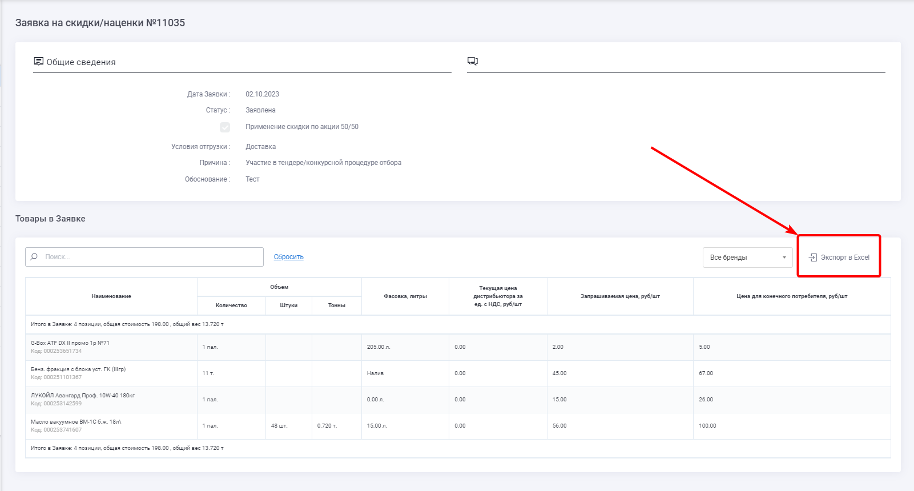
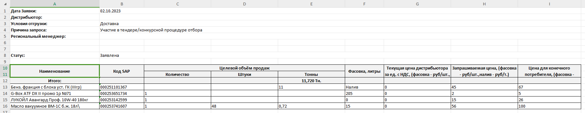

# 02 Заявки на скидки/наценки																		
Функциональность Заявок на скидки/наценки дает возможность пользователю системы (Контрагенту) сформировать заявку на предоставление скидок/наценок на определенный набор товаров, а региональному менеджеру провести предварительное согласование и отправить документ на согласование в АСКУ.  

Список доступной продукции в Заявке отвечает следующим условиям:
- Список продуктов в Заявке может включать в себя продукцию по всем договорам.
- Список продуктов в Заявке не зависит от ограничений ассортимента для данного контрагента.
- Список включает в себя все продукты, у которых есть базовые цены для данного контрагента. Базовые цены должны быть действующими в момент подачи Заявки.   

Заявки на скидки/наценки оформляются только контрагентом и только на стороне ЛКК и передаются в АСКУ в обменном процессе.  

Информация о статусе Заявки также передается в обменном процессе из АСКУ в ЛКК.  

Данные для заявок подтягиваются из следующих источников:
1. Список товаров ГПН СМ формируется на основе справочника «Каталог товаров». Данные справочника поступают в ЛКК из АСКУ.
2. Данные параметров «емкость», «паллетная норма», «вес нетто» также хранятся в справочнике «Каталог товаров». Параметры «паллетная норма», «вес нетто» требуются для расчета количества штук и тонн исходя из указанного объема.
3. Данные параметра «Текущая цена дистрибьютора за ед. с НДС, руб./шт» формируются из справочника «Цены номенклатуры». В данной колонке отображается основная базовая цена для сегмента текущего контрагента». Для контрагентов типа «Экспорт» не отображается.  
4. Такие данные, как «Объем продукции», «Цена для конечного покупателя за ед. с НДС, руб./шт» (Цена ГПН СМ и цена конкурента) также вводится пользователем вручную. Настройки справочников и интеграция со сторонними системами на данном этапе не запланирована. Объем для фасованной продукции указывается в паллетах, для наливной продукции в тоннах.
5. Флаг «Применение скидки по программе 50/50» проставляется автоматически от основного ценового соглашения и связи сегмента с ним.  

Для каждого продукта в Заявке может быть указан только один конкурент и только один продукт конкурента.  

Сохранить Заявку на скидки/наценки можно двумя способами: 
1. Сохранить как черновик.  
   a. Заявка не передается региональному менеджеру или в АСКУ.  
   b. Заявку можно редактировать.  
2. Отправить на согласование.  
   a. Заявка передается региональному менеджеру и в АСКУ.  
   b. Заявку нельзя редактировать.  

Доступность Заявок для Регионального менеджера определяется связью регионального менеджера с контрагентом.  
Заявка на скидки/наценки доступна только для регионального менеджера, которого выбрал контрагент при создании заявки.  
Выбор регионального менеджера осуществляется в момент создания заявки в поле «Региональный менеджер» – выпадающий список, который состоит только из числа РМ закрепленных за данным дистрибьютором.  
Для новой формы заявки на с/н, если создана запись в HL-блоке «Заявка на запрос СЦ. Ограничения выбора РМ», то отображается список региональных менеджеров из поля «Региональный менеджер» в HL-блоке «Заявка на запрос СЦ. Ограничения выбора РМ».  
Если записи не найдены в HL-блоке «Заявка на запрос СЦ. Ограничения выбора РМ», то в поле «Региональный менеджер» отобразится РМ, у которых текущий контрагент указан в поле «Контрагенты РМ». 

## Сценарий подачи Заявки
Процесс создания и согласования Заявки на скидки/наценки включает в себя несколько этапов:
1. Создание Заявки
2. Согласование Заявки региональным менеджером
3. Согласование Заявки отделом продаж и Торговым комитетом

### 1. Создание Заявки
При создании заявки контрагент заролняет следующие параметры:
- Договор – для контрагентов типа «Экспорт». 
- Страна назначения (конечного покупателя) – для контрагентов типа «Экспорт».
- Региональный менеджер – выпадающий список, который состоит только из числа РМ закрепленных за данным дистрибьютором. Отображается только для контрагентов типа «ВР».  Для новой формы заявки на с/н, если создана запись в HL-блоке «Заявка на запрос СЦ. Ограничения выбора РМ», то отображается список региональных менеджеров из поля «Региональный менеджер» в HL-блоке «Заявка на запрос СЦ. Ограничения выбора РМ». Если записи не найдены в HL-блоке «Заявка на запрос СЦ. Ограничения выбора РМ», то в поле «Региональный менеджер» отображается РМ, у которых текущий контрагент указан в поле «Контрагенты РМ».
- Срок действия – дата окончания действия ценового соглашения, которое будет создано на основании данной заявки.
- Обоснование – текстовое обоснование для предоставления контрагенту скидки/наценки.
- Конечный покупатель – компания, для которой планируется продажа продукции по ценам, установленным в Заявке. Если у контрагента пользователя типа «ВР» в информации профиля не заполнено поле «Новая форма заявок на с/н с даты:», то поле принимает любые вводимые значения. Если контрагент типа «Экспорт», то поле всегда принимает любые вводимые значения. 
- Конечный покупатель – компания, для которой планируется продажа продукции по ценам, установленным в Заявке.  Если у контрагента пользователя типа «ВР» в информации профиля заполнено поле «Новая форма заявок на с/н с даты:» датой, которая меньше даты создания заявки на с/н, то поле в выпадающем списке выводит только тех конечных покупателей, которые привязаны к текущему контрагенту. Список покупателей приходит в справочнике «Заявка на запрос СЦ. Конечные клиенты Mercapp». 
- ИНН – если выбран один конечный покупатель, указать его ИНН и КПП.
- КПП – если выбран один конечный покупатель, указать его ИНН и КПП.
- Список товаров. В рамках списка товаров контрагент указывает:
  - Параметры продукции (объем).
  - Цены для конечного покупателя за единицу продукции с НДС (цена ГПН СМ и цена конкурента). 

На основании введенных контрагентом данных автоматически определятся предложение по цене для конечного покупателя.  
Предложение для каждого товара рассчитывается по формуле:  
(Текущая цена ГПН-СМ для дистрибьютора с учётом всех скидок, с НДС)*(1+Затраты дистрибьютора)*(1+Маржа дистрибьютора)  

После заполнения всех данных контрагент отправляет заявку на согласование Региональному менеджеру.  
В этот момент Заявке присваивается статус «Заявлена».  

Региональный менеджер получает email-уведомление о создании в ЛКК новой Заявки.  
Email Регионального менеджера для контрагента определяется на уровне Договоров контрагента.  
Данные поступают в ЛКК из АСКУ в рамках справочника «Договоры».  
Если у контрагента по его договорам определено несколько региональных менеджеров, то уведомление передается всем менеджерам и все они получают возможность согласовать данную Заявку.  

У контрагентов типа «Экспорт» заявка сразу отправляется в АСКУ, региональный менеджер не ведет заявки «Экспорта» через ЛКК, в договорах у контрагентов нет email региональных менеджеров.  
Все изменения статусов происходят между АСКУ и пользователем в ЛКК.   

### 2. Согласование Заявки региональным менеджером
В рамках согласования заявки региональный менеджер имеет возможность добавить в Заявку следующие данные:
- Ответственный менеджер ГПН СМ.
- Флаг «Самовывоз». При положительном значении – Самовывоз, при отрицательном значении – Доставка. 
- Комментарий. Если в Заявку требуется внесение изменений, менеджер может оставить для контрагента комментарий о том, что именно нужно изменить.
- Флаг «Применение скидки по программе 50/50». Изменить значение флага.

После обработки Заявки менеджер может сделать одной из двух действий:
- Вернуть Заявку контрагенту. В этом случае:
  - Заявке присваивается статус «Требуется доработка».
  - Контрагент получает email-уведомление об изменении статуса.
  - Контрагент имеет возможность внести любые изменения в Заявку.
- Передать Заявку на согласование в отдел продаж. В этом случае:
  - Заявке присваивается статус «Согласовано РМ».
  - Заявка передается в АСКУ.
  - Контрагент получает email-уведомление об изменении статуса.
  - Контрагент уже не может вносить изменения в Заявку.

### 3. Согласование Заявки отделом продаж и Торговым комитетом

После отправки Заявки в систему АСКУ запускается процесс согласования Заявки сотрудниками ГПН СМ, который проходит за рамками ЛКК. 
В результате согласования Заявка может получить в АСКУ следующие статусы:
- Утверждена.
- Отклонена.

В момент установки статуса со стороны АСКУ инициируется обменный процесс, в рамках которого из АСКУ в ЛКК передается актуальный статус Заявки. В момент изменения статуса из ЛКК отправляется email-уведомление контрагенту о смене статуса Заявки.
Контрагент не имеет возможности корректировать заявку ни в одном из этих статусов.

## Статусная схема Заявок на скидки/наценки
Жизненный цикл Заявки выглядит следующим образом:

№|Статус|Описание статуса|Уведомление о присвоении статуса
:-:|:-|:-|:-
1|Черновик|Заявка создана и сохранена в ЛКК. Доступна для просмотра и редактирования только дистрибьютору|Не предусмотрены
2|Заявлена|Статус присваивается на основании факта создания Заявки в ЛКК. Статус присваивается в ЛКК. Редактирование контрагентом недоступно|Уведомление отправляется рег. менеджеру из ЛКК
3|На доработку дистрибьютору|Статус присваивается в ЛКК на основании Действия Рег. менеджера. Для контрагентов типа «Экспорт» статус устанавливается в АСКУ. Редактирование контрагентом доступно|Уведомление отправляется контрагенту из ЛКК
4|Согласованно РМ|Статус присваивается в ЛКК на основании Действия Рег. менеджера. При переходе в данный статус Заявка передается в АСКУ.Редактирование контрагентом недоступно.|Уведомление отправляется контрагенту из ЛКК
5|На доработку РМ|Статус передается из АСКУ в ЛКК при необходимости корректировки заявки Рег. Менеджером.|Уведомление отправляется РМ из ЛКК
6|Вынесена на ТК|Статус передается из АСКУ в ЛКК. Редактирование контрагентом недоступно.|Не предусмотрены
7|Согласованно НОП|Статус передается из АСКУ в ЛКК. Редактирование контрагентом недоступно.|Не предусмотрены
8|Согласовано|Статус передается из АСКУ в ЛКК после завершения согласования. Редактирование контрагентом недоступно.|Уведомление отправляется контрагенту из ЛКК
9|Отклонена|Статус передается из АСКУ в ЛКК после завершения согласования. Редактирование контрагентом недоступно.|Уведомление отправляется контрагенту из ЛКК

## Печатная форма Заявок на скидки/наценки
При создании заявки в ЛКК, формируется её печатная форма, которая представляет собой Excel-файл с информацией по заявке.
Excel-файл доступен для скачивания в интерфейсе ЛКК по ссылке "Экспорт в Excel" при создании, просмотре и редактировании заявки.

### Структура шаблона excel-файла  
Шаблон состоит из двух блоков:
1. Общие параметры Заявки на скидки/наценки
2. Таблица товаров

  

#### 1. Общие параметры Заявки на скидки/наценки
- Дата Заявки
- Дистрибьютор
- Условия отгрузки
- Причина запроса
-	Реестровый номер тендера (при выборе причины запроса "Участие в тендере\конкурсной процедуре отбора".)
- Региональный менеджер
- Статус

#### 2. Таблица товаров
Таблица содержит следующие столбцы:
- Наименование товара в соответствии с договором.
- Код SAP
- Целевой объём продаж, с подразделами:
  - Количество
  - Штуки
  - Тонны
- Фасовка, литры
- Текущая цена дистрибьютора за ед. с НДС, (фасовка - руб/шт., налив - руб/т.)
- Запрашиваемая цена, (фасовка - руб/шт.,налив - руб/т.)
-	Запрашиваемая скидка, (фасовка - %/шт., налив - %/т.)
- Цена для конечного потребителя, (фасовка - руб/шт., налив - руб/т.)  
Также таблица содержит строку "Итого" с подсуммировкой по столбцам, отображающим Целевой объём продаж.
  