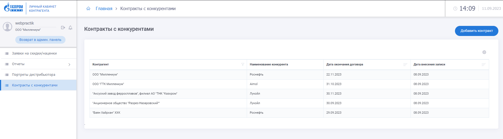
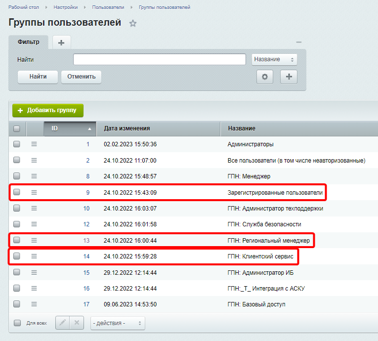
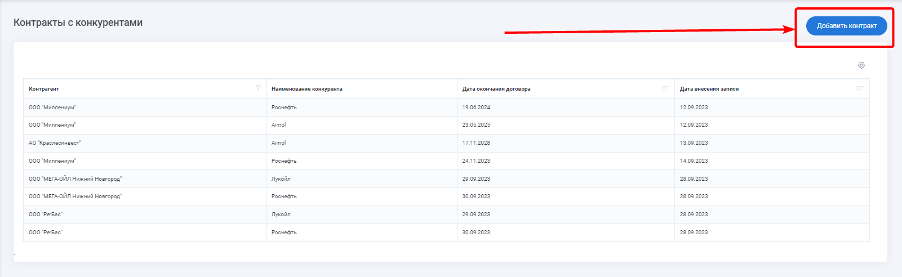
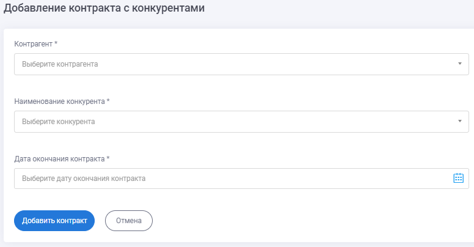

# 06 Контракты с конкурентами																		
В ЛКК реализован раздел «Контракты конкурентов» 

Доступен только для трёх групп пользователей: 
1. «ГПН: Региональный менеджер»
2. «ГПН: Клиентский сервис»
3. «Зарегистрированные пользователи»

Каждая группа пользователей имеет разный доступ к разделу:  

| № |Группа пользователей|Вид доступа|  
|:-:|:-|:-|  
|1  |«ГПН: Региональный менеджер» (РМ)»|Просмотр записей своих контрагентов, фильтрация по контрагенту, добавление записей|  
|2  |«ГПН: Клиентский сервис»          |Просмотр записей своих контрагентов, фильтрация по контрагенту|  
|3  |«Зарегистрированные пользователи» |Просмотр записей своего контрагента|  

### 1. Интерфейс для пользователя группы «ГПН: Региональный менеджер».
На главной странице раздела отображается таблица со столбцами:

№ |Элемент|Поведение|Дополнение
:-:|:-|:-|:-  
1|Контрагент|Доступен фильтр по контрагенту.В фильтре выпадающий список из связанных с РМ дистрибьюторов с возможностью выбора нескольких значений|Набор контрагентов в списке определяется из значений дополнительного поля пользователя «Контрагенты РМ».
2|Наименование конкурента| |		
3|Дата окончания договора|Доступна сортировка по возрастанию/убыванию|	
4|Дата внесения записи|Доступна сортировка по возрастанию/убыванию|	

Над таблицей отображается кнопка «Добавить контракт».

При нажатии на кнопку «Добавить контракт» открывается форма для добавления записи
  
Описание элемнтов формы:

№|Элемент|Поведение|Дополнение
:-:|:-|:-|:-  
1|Контрагент|Выпадающий список из связанных с РМ дистрибьюторов.|Набор значений в список определяется из значений дополнительного поля пользователя «Контрагенты РМ»|	 
2|Наименование конкурента|Обязательное поле. Выпадающий список из значений HL-блока «Конкуренты».|	
3|Дата окончания договора|Обязательное поле типа date.|
4|Кнопка «Добавить контракт»|При нажатии на кнопку данные записываются в HL-блок «Контракты с конкурентами»|

### 2. Интерфейс для пользователя группы «ГПН: Клиентский сервис».
На главной странице раздела отображается таблица со столбцами:

№|Элемент|Поведение|Дополнение  
:-:|:-|:-|:-  
1|Контрагент|Доступен фильтр по контрагенту|В фильтре выпадающий список из связанных с КС дистрибьюторов с возможностью выбора нескольких значений  
2|Наименование конкурента| | 
3|Дата окончания договора|Доступна сортировка по возрастанию/убыванию| 
4|Дата внесения записи|Доступна сортировка по возрастанию/убыванию| 

### 3. Интерфейс для пользователя группы «Зарегистрированные пользователи».
На главной странице раздела отображается таблица со столбцами:

№|Элемент|Поведение|Дополнение  
:-:|:-|:-|:-  
1|Контрагент| |		
2|Наименование конкурента| |		
3|Дата окончания договора|Доступна сортировка по возрастанию/убыванию|	
4|Дата внесения записи|Доступна сортировка по возрастанию/убыванию|	

### HL-блок «Конкуренты»
Данные о конкурентах записываются в HL-блок «Конкуренты»:

№|Поле, обязательность|Код поля в ЛКК|Тип данных
|:-:|:-|:-|:-| 
1|Наименование конкурента*|UF_NAME|строка, 255 символов
2|Наименование конкурента EN|UF_NAME_EN|строка, 100 символов 
3|Идентификатор 1С конкурента*|UF_1C_ID|строка, 100 символов   

### HL-блок «Контракты с конкурентами»
Данные о контрактах с конкурентами записываются в HL-блок «Контракты с конкурентами»:

№|Поле, обязательность|Описание|Код поля в ЛКК|Тип данных
:-:|:-|:-|:-|:-
1|Контрагент*|Наименование контрагента|UF_NAME|Строка, 255 символов
2|Идентификатор 1С контрагента*|Значение GUID-а присвоенного контрагенту в системе 1С АСКУ|UF_1C_ID|Строка, 100 символов 
3|Наименование конкурента*|Наименование конкурента|UF_СOMPETITOR_NAME|Строка, 255 символов
4|Наименование конкурента EN|Наименование конкурента на английском языке|UF_СOMPETITOR_NAME_EN|Строка, 255 символов
5|Дата окончания договора*|Дата окончания договора контрагента с конкурентом|UF_CONTRACT_END_DATE|Дата. Формат: «ГГГГ-ММ-ДД»
6|Дата внесения записи*|Дата создания записи в ЛКК|UF_CONTRACT_CREATED_AT|Дата со временем. Формат: «ГГГГ-ММ-ДДTчч:мм:сс»
7|Идентификатор 1С конкурента*|Значение GUID-а присвоенного конкуренту в системе 1С АСКУ|UF_COMPETITOR_1C_ID|Строка, 100 символов  

После сохранения данных в ХЛ блоке "Контракты с конкурентами", они передаются в 1С АСКУ (SOAP метод contractСompetitor описан в [интеграционных требованиях](/docs/06IR/contractСompetitorIR)).